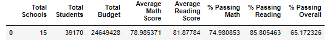
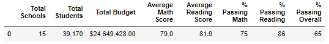
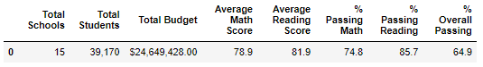

# School_District_Analysis

## Overview

In this module, we used Python's Pandas and NumPy libraries to remove Thomas High School's ninth-grade class and re-analyze our school district data.

## Results

Module District Dataframes

Challenge Replacement District Dataframe

The removal of Thomas High School's ninth-grade class caused the following changes in the district summary (differences calculated using the unrounded module district summary dataframe instead of the formatted module district summary for accuracy):

- Decrease in average math score by 0.1 points
- Decrease in math passing percentage by 0.2%
- Decrease in reading passing percentage by 0.1%
- Decrease in overall passing percentage by 0.3%

Since only Thomas High School had data altered, it is the only row affected in the school summary with the following changes:

- Decrease in average math score by 0.067 points
- Increase in average reading score by 0.047 points
- Decrease in math passing percentage by 0.086%
- Decrease in reading passing percentage by 0.290%
- Decrease in overall passing percentage by 0.318%

After removing data from their ninth-grade class, Thomas High School remained second in the district in overall passing percentage.

The math and reading scores by grade dataframes were mostly unaffected by the replacement, as the cell for Thomas High School's ninth-grade class becomes null while every other cell remains the same since they are completely separate groups.

Thomas High School spent an average of $638 per student, placing them into the $631-$645 spending bin.  Score averages were rounded to the nearest tenth of a point and passing rates were rounded to the nearest whole percent.  There were no differences in the module and challenge spending summary dataframes.

Scores by school size were also unchanged.  Thomas High School is a medium-sized school, so only the medium row could have changed, and any differences were not large enough to be displayed with our tables' number of significant figures.

Thomas High School is a charter school.  The Charter row was unchanged, and thus the school type dataframes remain the same after the replacement.

## Summary

We are able to see that at the district level, the raw score metrics were largely similar, while the passing rates each fell by around a couple tenths of a percent each.  Most notably, the overall district passing rate fell by 0.3%.  While this appears a small number, in a district with over 39,000 students, changes in tenths of percents are still notable.

When we examine the school summary dataframes, we see that compared to the district, Thomas High School has a similar decrease in overall passing percentage, disproportionately larger decrease in reading passing percentage, and disproportionately smaller decrease in math passing percentage.  This is because the district overall has a much higher passing rate for reading than for math.  Thomas High School has high marks in both metrics both before and after the replacement, so at the district level the changes are more strongly felt in the metric with the significantly lower average, which is math.

It is interesting that the replacement caused Thomas High School's average reading scores to actually increase by a small amount, while the reading passing rate decreased by almost three tenths of a percent.  This would imply that before replacement, Thomas High School's ninth-grade class either had a disproptionately high number of very marginal passing grades, or a disproportionately high number of very low failing grades.

Somehow, we are able to notice changes at the district level but not when the data is grouped by school spending, size, or type.  Thomas High School's very high marks in both math and reading in drive it to the district's second best overall passing percentage.  This means that their 461 ninth-graders represented a small but decent portion of the right tail of the district data's metrics.  Thomas High School's scores were also very uniform across grades.  While their 461 ninth graders represent a larger portion of each of the bins they are in than of the district, they and Thomas High School's averages are mostly closer to those of their bins than those of the district, leading the replacement to not cause significant enough differences to be noticed in our updated dataframes for spending, size, and type.
